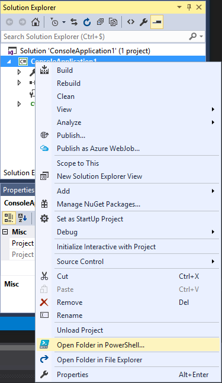
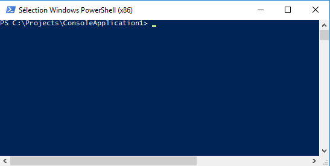

# Open PowerShell Prompt

Download this extension from the [VS Gallery](https://visualstudiogallery.msdn.microsoft.com/e98f54f4-199f-4da2-9395-e43f07b0286e)
or get the [CI build](http://vsixgallery.com/extension/OpenPromptHere.SpringComp/).

---------------------------------------

Open a PowerShell command prompt at the target location of the selected project.

See the [changelog](CHANGELOG.md) for changes and roadmap.

## Features

This extension allows you to open a PowerShell prompt to the target path of the selected project in Solution Explorer.

### Open PowerShell Prompt

In Solution Explorer, select and right-click a Project.
Select the "Open Folder in PowerShell..." command.

You'll notice a PowerShell Prompt opens at the specified location.

## Contribute
Check out the [contribution guidelines](CONTRIBUTING.md)
if you want to contribute to this project.

For cloning and building this project yourself, make sure
to install the
[Extensibility Tools 2015](https://visualstudiogallery.msdn.microsoft.com/ab39a092-1343-46e2-b0f1-6a3f91155aa6)
extension for Visual Studio which enables some features
used by this project.

## License
[Apache 2.0](LICENSE)